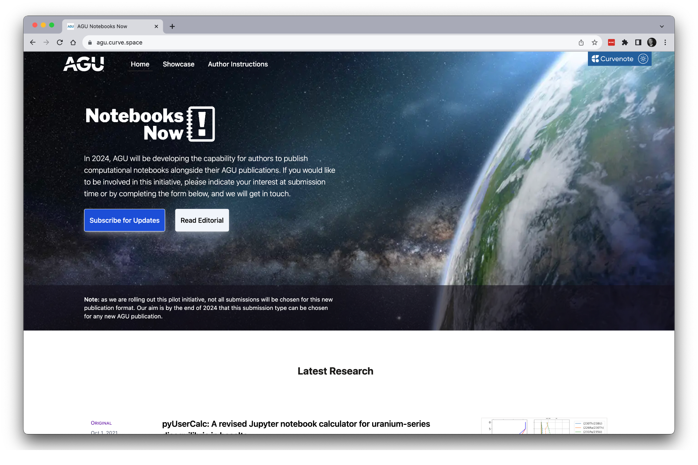

# Selected Examples from AGU Notebooks now

This example site contains some elements from the Notebooks Now example articles posted at the AGU 2023 fall meeting.

The original articles were published in 2021 and in collaboration with the authors, were updated with new plots to fit into the publication templates developed during Notebooks Now! and extended to show off what you can do when you have the ability to publish a computational article.

The full examples can be found on the Notebooks Now! journal [agu.curve.space](https://agu.curve.space), and parts of these are reproduced here.



## Selected Interactive Plots

### pyUserCalc: A revised Jupyter notebook calculator for uranium-series disequilibria in basalts - [](10.1029/2020EA001619)

The article presents an open source, reproducible tool for modeling U-series in basalts, enabling equilibrium and pure disequilibrium porous flow U-series models with 1D conservation of mass.

The interactive figure below allows for a comparion between equilibrium and disequilibrium models for a number of different parameters noteably the $Da$ Number.

```{figure} #elkins2021-plot

```

### VESIcal: An open-source thermodynamic model engine for mixed volatile (H₂O-CO₂) solubility in silicate melts - @iacovino2021

The article presents VESIcal (Volatile Equilibria and Saturation Identification calculator) a thermodynamic modelling toolset.

The interactive figure below plots H$_2$O-CO$_2$ isobars based on specific samples from the Cerro Negro Melt Inclusions dataset.

```{figure} #iacovino2021-plot

```
